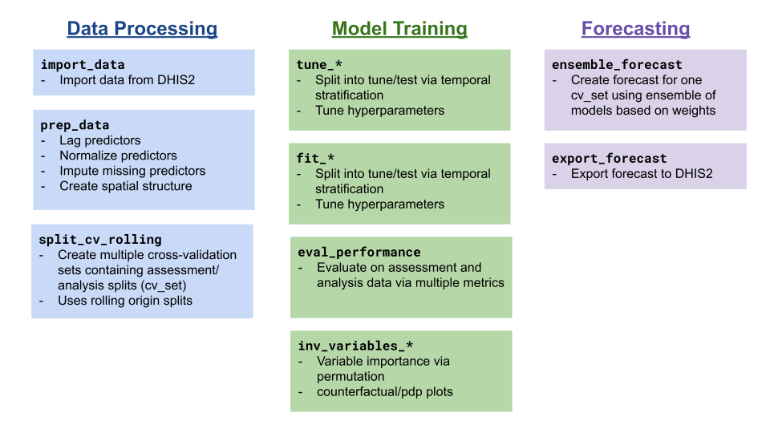

<!-- README.md is generated from README.Rmd. Please edit that file -->

```{r, include = FALSE}
knitr::opts_chunk$set(
  collapse = TRUE,
  comment = "#>",
  fig.path = "man/figures/README-",
  out.width = "100%"
)
```

<!-- badges: start -->
[](https://lifecycle.r-lib.org/articles/stages.html#experimental)
<!-- badges: end -->

The goal of PRIDEC is to provide a standardized API functionality for forecasting infectious diseases from DHIS2 data.


## Installation

You can install the development version of PRIDEC from [GitHub](https://github.com/) with:

``` r
# install.packages("devtools")
devtools::install_github("Pivot-Madagascar/PRIDEC-package")
```

## Example

TThe PRIDE-C forecasting approach follows the following steps:

1. Data processing
2. Model tuning and training
3. Forecasting



The example below follows the steps for fitting a Random Forest model using `ranger` from simulated model data.

```{r}
library(PRIDEC)

data(demo_malaria)

#preprocess data set
data_clean <- prep_data(raw_data = demo_malaria,
                        y_var = "n_case",
                        lagged_vars =  c("rain_mm", "temp_c"),
                        scaled_vars = NULL,
                        graph_poly = NULL)
#create a cv_fold of assessment (historical) and analysis (forecast) data
cv_set <- split_cv_rolling(data_clean$data_prep, 
                           month_analysis = 48, 
                           month_assess=3)[[20]]

#fit the model and forecast
rf_fit <- fit_ranger(cv_set, 
                     y_var = "n_case",
                     id_vars = c("orgUnit", "date"),
                     pred_vars = c("rain_mm", "temp_c", "month_season", "orgUnit"))

#evaluate model fit
eval_performance(rf_fit)
plot_predictions(rf_fit[rf_fit$orgUnit %in% sample(rf_fit$orgUnit,1),])

```

