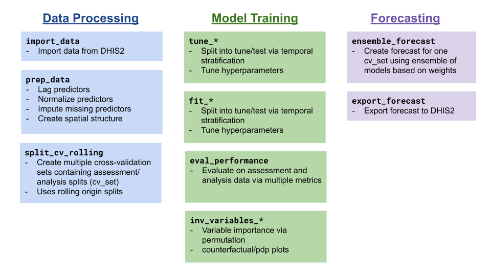
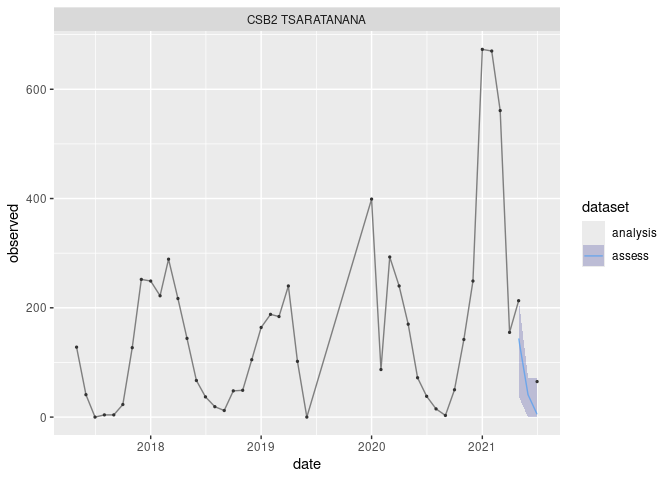

# Predicting Infectious Diseases via Environment and Climate (PRIDE-C)

<!-- README.md is generated from README.Rmd. Please edit that file -->
<!-- badges: start -->

[](https://lifecycle.r-lib.org/articles/stages.html#experimental)
<!-- badges: end -->

The goal of PRIDE-C is to provide a standardized API functionality for
forecasting infectious diseases from DHIS2 data.

## Installation

You can install the development version of PRIDEC from
[GitHub](https://github.com/) with:

``` r
# install.packages("devtools")
devtools::install_github("Pivot-Madagascar/PRIDEC-package")
```

## Example

TThe PRIDE-C forecasting approach follows the following steps:

1.  Data processing
2.  Model tuning and training
3.  Forecasting



The example below follows the steps for fitting a Random Forest model
using `ranger` from simulated model data.

``` r
library(PRIDEC)

data(demo_malaria)

#preprocess data set
data_clean <- prep_data(raw_data = demo_malaria,
                        y_var = "n_case",
                        lagged_vars =  c("rain_mm", "temp_c"),
                        scaled_vars = NULL,
                        graph_poly = NULL)
#> Registered S3 method overwritten by 'quantmod':
#>   method            from
#>   as.zoo.data.frame zoo
#create a cv_fold of assessment (historical) and analysis (forecast) data
cv_set <- split_cv_rolling(data_clean$data_prep, 
                           month_analysis = 48, 
                           month_assess=3)[[20]]

#fit the model and forecast
rf_fit <- fit_ranger(cv_set, 
                     y_var = "n_case",
                     id_vars = c("orgUnit", "date"),
                     pred_vars = c("rain_mm", "temp_c", "month_season", "orgUnit"))

#evaluate model fit
eval_performance(rf_fit)
#> Registered S3 method overwritten by 'scoringutils':
#>   method         from    
#>   print.forecast forecast
#> # A tibble: 2 × 10
#>   dataset    wis   mae med_ae mean_ae_log  wape dispersion sp_rho prop_over
#>   <chr>    <dbl> <dbl>  <dbl>       <dbl> <dbl>      <dbl>  <dbl>     <dbl>
#> 1 analysis  5.86  6.42  0.321      0.0220 0.150       5.12  0.961    0.206 
#> 2 assess   24.4  33.1  32.2        1.08   0.608       2.34  0.814    0.0317
#> # ℹ 1 more variable: prop_under <dbl>
plot_predictions(rf_fit[rf_fit$orgUnit %in% sample(rf_fit$orgUnit,1),])
#> Warning: Removed 1 row containing missing values or values outside the scale range
#> (`geom_point()`).
```



## Contribute to PRIDE-C

As an open-source package, we welcome all contributions. Please feel
free to file an issue or contact the developer (@mvevans89).

## Funding

The development and maintenance of this package is funded by a [Wellcome
Trust Digital Technology Development
Award](https://wellcome.org/grant-funding/schemes/digital-technology-development-awards-climate-sensitive-infectious-disease).
